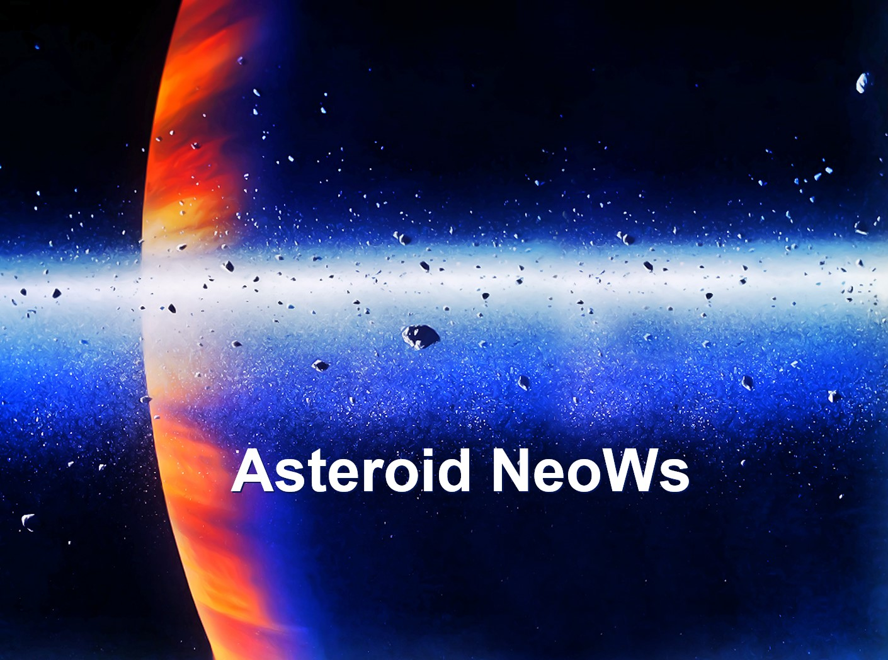
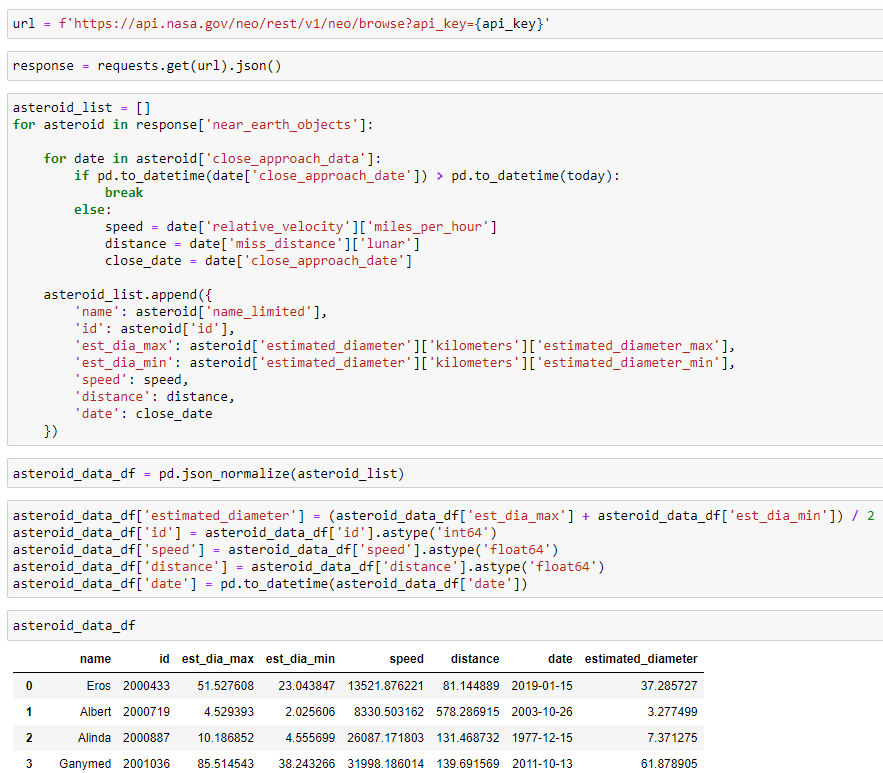
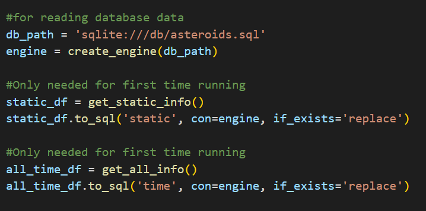
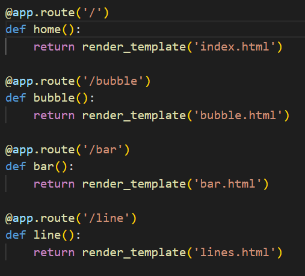
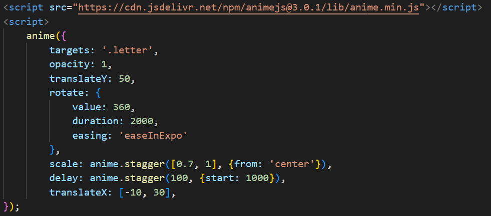
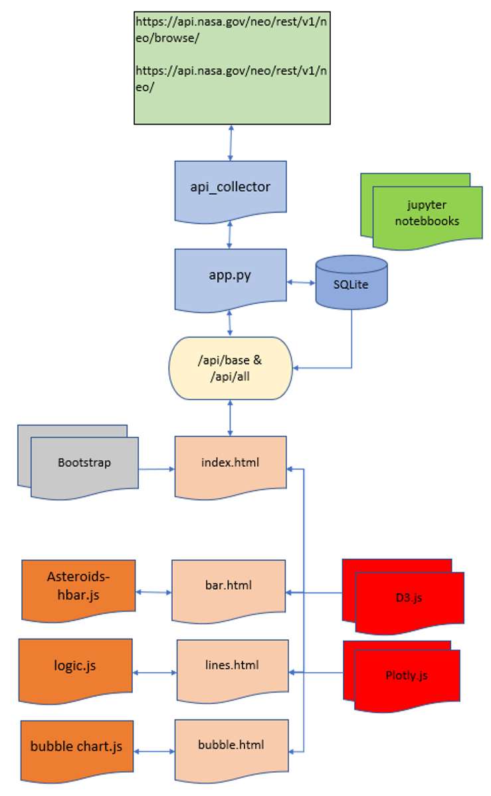
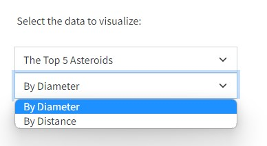
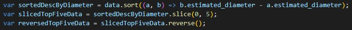
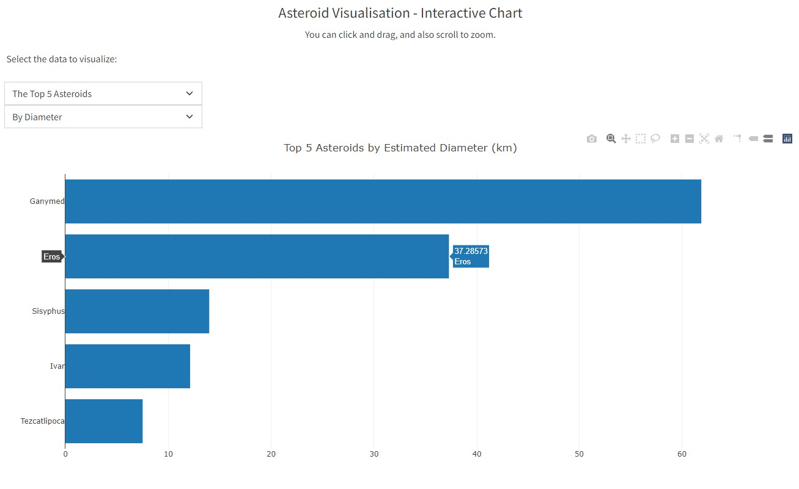
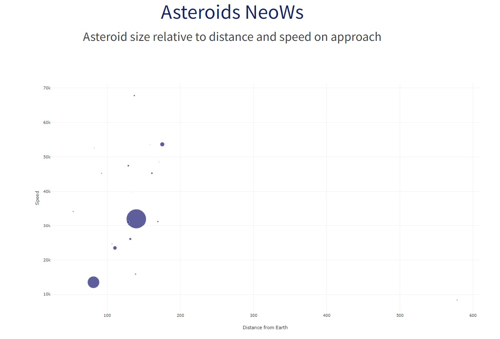

# <Asteroids>

## Project NeoWs : NASA's Near Earth Object Web Service

What is NeoWs? NeoWs is the Near Earth Object Web Service which is a NASA web Service containing information relating to near earth asteroids and their specific data such as size, speed and distance over periodic observations.

Our motivation for the project was to evaluate the effectiveness of aligning data processing technologies to allow the user to be able to investigate a NASA datasource.

The project was constructed to demonstrate the effectiveness of the management and flow of data that will enable a user to explore, understand and conclude enquiries relating to near earth asteroid objects.

It solves and demonstrates how data technologies can be combined to create a data-pipeline from source to visualisation. 

The project stands out because it successfully utilises data on objects on the galaxy scale and gives a user opportunity to explore and understand the nature of an individual asteroid.  

Our application takes the data using an API enquiry to the NASA source and then, using python code with FLASK, interface with an SQL Database. This in turn facilitates an internal API call to supply an HTML / Javascript solution to create user driven visualisations. D3 and Plotly were utlised for this purpose. 

The data technologies used in the application were considered to be the best solutions to acheive the end goal of the project. 
The most significant challenges that we faced were the initial organisation of the project team to co-ordinate and align our efforts. The next major challenge was to ensure the interfaces between the various data technologies allowed seamless communication and flow of data. The design of the visualisations to allow flexibility for the user to explore the data was the final element to complete the project goal.  

## James Hands  

The first thing I did was test the api, to see what kind of data we could get from the api. Then as a team we decided on the graphs we would be making. So then I made jupyter notebooks to make sure I collected the right data, while making sure it's in the right data types.

Then I made a python file which contained the same jupyter notebook code, but in function form. Then I made the app.py where sql achlemy could be used to write the data from the dataframes to a database (after the first time ran, it's not needed to use this part again, so it can be commented out).

Then a flask server was created. So then the data from the databases was queried and put onto a local api on the flask server (/api/base and /api/all). Then I created the directories for each page that would house each one of the visualisations and called their html from templates.

Then I made the index.html home page where you could direct to charts, but also I added a small animation which made the title at the top appear using the anime js library.

## Team

## Simon Butler  

The data available from the api was thoroughly reviewed to understand the content available and the structure. The project team defined the visualisations and user interactivty required. The bar chart specification involves the facility for the user to filter and sort the data to examine the top or bottom 5 asteroids with a choice of either diameter (in km) or distance from earth (in lunar units). 

  
The solution was to use a sort process with a sliced methodology with the option coded to reverse where necessary for top or bottom 5 records as dictated by the user selection in the drop down selections.

An example output is shown below: 

## Fazeleh Arjmandilari  

A drop-down menu was created using the base api which allows users to select the asteroid name. This then displayed a table showing some key facts about the asteroid based on the last sighting and also 2 line graphs showing the distance from earth and the speed of approach over time for the selected asteroid. The code for this can be found in the static/js folder in the logic.js file.

## Mariama Doumbouya Diallo  
For the bubble chart firstly, the Plotly library was imported because of the straightforward approach needed to make clear and comprehensive visualisations. 
We then used the D3 library to import our data which was already in JSON form and called on it to display the desired data. 
The resoning behind selecting a bubble chart was that the diameter of the marker would be a great representative of the diameter of our asteroids and would therefore make the comparison easier inbetween them.

