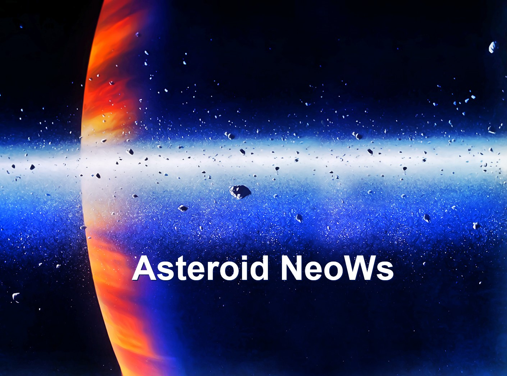

# <Asteroids>

## Project NeoWs : NASA's Near Earth Object Web Service

What is NeoWs? NeoWs is the Near Earth Object Web Service which is a NASA web Service containing information relating to near earth asteroids and their specific data such as size, speed and distance over periodic observations.

Our motivation for the project was to evaluate the effectiveness of aligning data processing technologies to allow the user to be able to investigate a NASA datasource.

The project was constructed to demonstrate the effectiveness of the management and flow of data that will enable a user to explore, understand and conclude enquiries relating to near earth asteroid objects.

It solves and demonstrates how data technologies can be combined to create a data-pipeline from source to visualisation. 

The project stands out because it successfully utilises data on objects on the galaxy scale and gives a user opportunity to explore and understand the nature of an individual asteroid.  

Our application takes the data using an API enquiry to the NASA source and then, using python code with FLASK, interface with an SQL Database. This in turn facilitates an internal API call to supply an HTML / Javascript solution to create user driven visualisations. D3 and Plotly were utlised for this purpose. 

The data technologies used in the application were considered to be the best solutions to acheive the end goal of the project. 
The most significant challenges that we faced were the initial organisation of the project team to co-ordinate and align our efforts. The next major challenge was to ensure the interfaces between the various data technologies allowed seamless communication and flow of data. The design of the visualisations to allow flexibility for the user to explore the data was the final element to complete the project goal.  

<!-- ## Table of Contents ONLY IF NEEDED

## How to Install and Run the Project

## Usage (include screenshots if you can)

## Credits -->

## James Hands  
## Simon Butler  
## Fazeleh Arjmandilari  
## Mariama Doumbouya Diallo  
